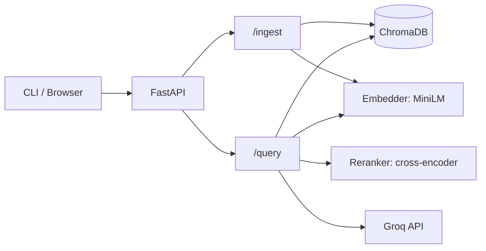

# CRAG (Codebase RAG)

A retrieval-augmented generation (RAG) API that answers natural-language
questions about any public GitHub repository, with citations to specific
files and line numbers.

## Demonstration

```bash
# Ingest a repo
uv run python cli.py ingest https://github.com/pallets/click

# Ask a question
uv run python cli.py query "How does the echo function work?" --repo click
```

```
The `click.echo` function is a thin wrapper around low-level I/O that
mimics `print` but adds Click-specific handling. When called, it first
chooses a target stream: if no `file` argument is given it uses `stdout`
or `stderr` depending on the `err` flag...

Citations:
  src/click/utils.py:252-346 (echo)
```

## Quick start

### 1. Start the Server

#### Clone the Repo

```bash
git clone https://github.com/tahir-asif/CRAG
cd codebase-rag-api
```

#### Get Groq API key

_Note to recruiters: If you prefer, you may contact me to use my API key_

1. Go to [console.groq.com](https://console.groq.com).
1. Create an account (sign in with Google worked best for me).
1. Open the _API Keys_ page and click _Create API Key_.
1. Give it a name (e.g. `crag`).
1. Copy the key. It starts with `gsk_` and is only shown once.
1. Paste it into your `.env` file:

```bash
echo "GROQ_API_KEY=your_key_here" > .env
```

#### Docker (recommended)

Run this from the directory you cloned earlier:

```bash
docker-compose up -d
```

#### Local development

Requires Python 3.12 and [uv](https://docs.astral.sh/uv/).

```bash
uv sync
make dev
```

`make help` lists all available commands.

### 2. Usage

#### Local Frontend

1. Go to `http://localhost:8000`
1. Ingest a repo using its github link, or use one of the included ones
1. Run query questions

#### CLI

```bash
uv run python cli.py --help
```

## Tech stack

- **Runtime:** Python 3.12, FastAPI, Pydantic v2
- **Vector store:** ChromaDB
- **Embeddings:** sentence-transformers (`all-MiniLM-L6-v2`, 384-dim, CPU)
- **Reranking:** sentence-transformers
  (`cross-encoder/ms-marco-MiniLM-L-6-v2`, CPU)
- **Keyword retrieval:** rank-bm25
- **LLM:** Groq (`openai/gpt-oss-120b`)
- **Ingestion:** GitPython
- **Testing:** pytest
- **Packaging:** uv, Docker

## How it works

The system has two flows: ingestion and query.

### Ingestion

Run once per repository.

1. Clone the repository shallowly (only the latest commit) into `repo_cache/`.
2. Walk the file tree, skipping `venv/`, `node_modules/`, `.git/`, and other non-source directories.
3. Split each file into chunks:
   - Python files are parsed with the `ast` module; one chunk per top-level function or class, with exact line ranges.
   - Non-Python files, or files that fail to parse, fall back to sliding line windows.
4. Embed each chunk with `all-MiniLM-L6-v2` (384-dim, CPU).
5. Persist chunks, embeddings and metadata to a ChromaDB collection named after the repo.

### Query

Run per question.

1. Embed the question with the same MiniLM model.
2. Retrieve candidates two ways in parallel:
   - Vector search: top 20 chunks by cosine similarity.
   - BM25 search: top 20 chunks by keyword relevance.
3. Fuse the two lists with Reciprocal Rank Fusion, keeping the top 10.
4. Rerank the 10 candidates with a cross-encoder (`ms-marco-MiniLM-L-6-v2`), keeping the top 5.
5. Send the top 5 chunks to Groq (`openai/gpt-oss-120b`) with instructions to answer using only the provided snippets and return structured JSON.
6. Parse the response, filter citations to only the chunks the model reported using, and return the answer with its sources.

See [Design decisions](#design-decisions) for further explanation.

## Architecture



## Evaluation

### Impact of pipeline components

Repo tested: [`https://github.com/tqdm/tqdm`](https://github.com/tqdm/tqdm)

| Variant              | Hit@5 | Hit@10 | MRR   |
|----------------------|-------|--------|-------|
| Vector only          | 0.867 | 0.933  | 0.622 |
| Hybrid (no rerank)   | 0.800 | 0.933  | 0.606 |
| Hybrid + rerank      | 0.933 | 0.933  | 0.756 |

### Methodology

- A repo is queried using 15 questions.
- Each question names 1–3 expected source files and 2–4 expected
  keywords. Correct answers must cite a listed file and contain the
  keywords.
- The `--variant` flag runs the same questions through different
  retrieval pipelines to isolate the contribution of each component.

### What this eval does not measure

- **Answer correctness**: The LLM generated answers were not tested. Only the retrieval pipeline was evaluated to see how well it's returned chunks matched what was expected.
- **Repo diversity**: Questions were written for only one repo.
- **Scale**: `tqdm` is roughly 300 chunks. A significantly larger repo may reveal unique issues.
- **Latency or cost**: Request timing appears in the server logs but is not part of the evaluation.

## Design decisions

- **AST-aware chunking**: one chunk per top-level function or class instead of fixed-size windows. Fixed windows split functions across chunks, and neither half is useful for retrieval or citations. Non-Python files fall back to sliding line windows, which is a limitation.
- **Hybrid retrieval**: vector search handles paraphrases, BM25 handles exact identifiers. They fail on complementary queries, so both run and results are fused.
- **Reciprocal Rank Fusion**: fuses by rank, not score. Avoids normalizing BM25's unbounded scores against cosine similarity's 0–1 range, and requires no weight tuning.
- **Cross-encoder reranking**: bi-encoders score query and chunk independently, which is fast but coarse. A cross-encoder reads them together for higher accuracy, so it's used only on the top 10 candidates from hybrid retrieval.
- **Groq for generation**: free tier (200,000 Tokens per day, 8,000 per day) with low-latency inference. Running `gpt-oss-120b` locally would need a GPU the project doesn't assume.
- **Local embeddings and reranking**: MiniLM and the cross-encoder run on CPU. No API cost for retrieval, no network round-trips, and the models are small enough (~240MB total) to bake into the Docker image.
- **Protocol-based adapters**: `VectorStore`, `Embedder`, and `Reranker` are Protocols with one concrete implementation each. Only the adapter modules import `chromadb`, `sentence-transformers`, or `torch`.

## Testing

```bash
make test          # offline suite (no network, ~50 tests)
make test-live     # includes tests that hit GitHub and Groq
```

## Limitations

**Current limitations:**

- **Python-only AST chunking**: Other languages fall back to line windows.
- **Accuracy**: Answers are LLM-generated and may be wrong, especially on subtle behavior questions. Always verify against the cited source before acting on an answer.
- **No incremental indexing**: Re-ingesting a repo replaces the whole index.
- **In-process inference**: Embedding and reranking run in the API process. Fine for single-user demos; a production system would extract them to a worker behind a queue to avoid GIL contention.
- **Synchronous ingestion**: Large repos block the request for the duration of the clone-chunk-embed pipeline.
- **Small eval set**: 15 questions per repo is enough to compare pipeline variants but not statistically robust.

**On the roadmap:**

- Tree-sitter chunking for JavaScript, TypeScript, and Go
- Incremental indexing (only re-embed changed files)
- Local LLM option (Ollama)

## Ethics

- **Code privacy**: Retrieved code snippets are sent to Groq's API for answer generation. Do not use this on private repositories or code you can't share with a third party. A local-LLM option is on the roadmap for sensitive workloads.
- **Licensing**: This tool indexes public repositories. Users are responsible for complying with the licenses of repositories they index and with their LLM provider's terms of service.

## License

[MIT](LICENSE)
